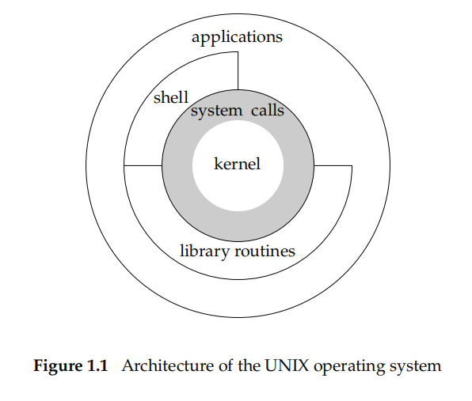

# About Operating System

Even though producer always put great effort in making the operating system distinguish themselves, there are one basic functionality the operating systems do provide in common:They **provide hardware resources control and runtime environments for programs to execute.** This means:

1. ability to execute program and provide certain inter-process communication ( IPC ) ways
2. ability to provides data storage operations ( file open\\read\\write )
3. ability to allocating resources for programs ( memory\\thread\\cpu resources )
4. provides certain programable network interfaces ( socket )
5. provides interfaces for new hardware driver ( hardware environment )

Just some random examples come across in mind :)

BTW, the part of the operating system provides this functionality is called kernel

# Unix System Architecture

The architecture of the unix system is shown above. The system provides

1. **system calls** as the kernel interfaces to the programs, which allow program require resources allocation from the operating system in a common and "safe" way.
2. **Library of common functions** are built on the top of the system calls interfaces, most of which provides "easy to use" methods for common operation(a typical example is the libstdc++)
3. **Shell** is a special program provides ability to run other application
