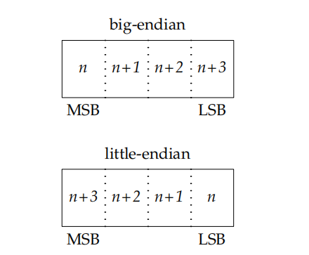

# About Socket

Normally, socket would be considered as a network IPC interface, which should be used for inter-process communication in different machine. But one simple fact is that **IPC comes first.** Socket is used for inter-process communication regradless where the processes are running. Socket is also designed for many networks protocals too.

# Socket File Descriptor

Applications use file descriptor to represent a socket. And just like opening a file, you opening a socket with options:

```C
// posix header
#ifdef LINUX
#include <sys/socket.h>
#endif
// windows header
#ifdef WINDOWS
#include <winsock2.h>
#pragma comment(lib "ws2_32.lib")
#endif
int socket(int domain, int type, int protocol);
```

About Argument:

*domain:* this argument determines the nature of connection, including the address format. The option constance start with AF_(for address family).

*type:* this argument defines the characteristic of the communication. The type of the socket would restrict how the data flows between the socket endpoints.

There are some option descriptions from apue:

* A SOCK_STREAM socket provides a byte-stream service; applications are unaware ofmessage boundaries. This means that when we read data from a SOCK_STREAM socket,it might not return the same number of bytes written by the sender. We will eventuallyget everything sent to us, but it might take several function calls.
* A SOCK_SEQPACKET socket is just like a SOCK_STREAM socket except that we get amessage-based service instead of a byte-stream service. This means that the amount ofdata received from a SOCK_SEQPACKET socket is the same amount as was written. The Stream Control Transmission Protocol (SCTP) provides a sequential packet service in the Internet domain.
* A SOCK_RAW socket provides a datagram interface directly to the underlyingnetwork layer (which means IP in the Internet domain). Applications are responsiblefor building their own protocol headers when using this interface, because the transportprotocols (TCP and UDP, for example) are bypassed. Superuser privileges are required

*protocol:* usually you could set this argument to 0 to select the default protocol given by the **domain** and **type** arguments. Or you could specify the protocol with the TCP/IP protocol suit

Return value:

On error, return -1; else return a fd represent socket

For the option details check the [man page](https://man7.org/linux/man-pages/man2/socket.2.html)

# Addressing

To communicate with a process in other machine, there are to things needed to specify.

* The **ip address** represent the machine in a certain network
* The **port number** represent the particular process in the operating system

( if you go all the way down and trying to construting a tcp packet on you own, you would find that the ip address is specified in the ip header and the port number is specified in the tcp header. It clearify the boundary of networking protocol (the IP and TCP) in a sense)

## Byte Ordering

The byte order is a characteristic of the processor architecture dadicating how the bytes are ordered within larger data type. The figure shown below demostrate the how the data layout in different byte ordering:


